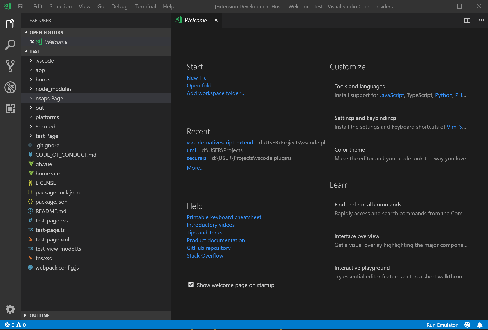

# NativeScript Extend for Visual Studio Code

Nativescript Extend pack contains snippets for all NativeScript UI core components , basic attributes and their descriptions, emulator runner, context menu and a xml validator. With all this listed you now have a perfect extention that will help you on your Nativescript projects This extension will only be available on Nativescript projects.

This extension comes with snippets, emulator executor, context menu for Nativescript project and a XML widgets, attributes and parameter validator.

All UI layout and widget are prefixed with `NS`. Attributes do not have a prefix.

> *Please note: To get the best out of this extension you wil have to disable or uninstall any nativescript snippets extension.*

# Changes

## [1.10.27] - 2018-10-27

- Newly added my updated Nativescript xsd schema, which will help you with Nativescript XML widgets, attributes and parameters validation [BETA STAGE].
- Added Auto setup emulator. It works only if you have android path on your system path or enviroment.
- Fixed file naming to all lowercase characters.
- Added "redhat.vscode-xml" extension to support xml validaion.
- Added "octref.vetur" extension to support vue sfc.
- Updated the `README.MD`

# Features

- ### Emulator,

- ### Emulator auto setup

- ### Snippets,

- ### Explorer Context Menu Page Creation,

- ### Nativscript XML widgets, attribute and parameters validation.

# Snippets Components keys

### Layouts

- Absolute Layout - `NSabsolute`
- Flexbox Layout - `NSflex`
- Dock Layout - `NSdock`
- Grid Layout - `NSgrid`
- Stack Layout - `NSstack`
- Wrap Layout - `NSwrap`

### Widgets

- Page - `NSpage`
- Action Bar - `NSactionbar`
- Label - `NSlabel`
- Text Field - `NStextfield`
- Text View - `NStextview`
- Image - `NSimg`
- Border - `NSborder`
- Button - `NSbtn`
- Search Bar - `NSsearchbar`
- Switch - `NSswitch`
- Slider - `NSslider`
- Progress - `NSprogress`
- Activity Indicator - `NSloading`
- Date Picker - `NSdate`
- Time Picker - `NStime`
- List Picker - `NSlistpicker`
- Segmented Bar - `NSsegmentedbar`
- Scroll View - `NSscrollview`
- Tab View - `NStabview`
- List View - `NSlistview`
- Web View - `NSwebview`
- Repeater - `NSrepeater`
- Password Field - `NSpassword`
- Action Item - `NSactionItem`

### Attributes

- backgroundColor - `bgColor`
- backgroundImage - `bgImage`
- borderColor - `borderColor`
- borderWidth - `borderWidth`
- translateX - `translateX`
- translateY - `translateY`
- margin - `margin`
- opacity - `opacity`
- style - `style`
- iosOverflowSafeArea - `iosOverflowSafeArea`
- cssClass - `class`
- left - `left`
- right - `right`
- top - `top`
- bottom - `bottom`
- action Bar Hidden - `actionBarHidden`
- Icon - `icon`
- xmlns - `xmlns`
- text - `text`
- icon - `icon`
- textWrap - `wrap`
- horizontalAlignment - `halign`
- verticalAlignment - `valign`
- visibility - `visibility`
- stretch - `stretch`
- keyboardType - `kbtype`
- colSpan - `colspan`
- rowSpan - `rowspan`
- row - `row`
- col - `col`
- width - `width`
- height - `height`
- itemWidth - `itemWidth`
- itemHeight - `itemHeight`
- colspan - `colspan`
- rowspan - `rowspan`
- dock - `dock`
- stretchLastChild - `stretchLastChild`
- flexDirection - `flexDirection`
- flexWrap - `flexWrap`
- justifyContent - `justifyContent`
- alignItems - `alignItems`
- alignContent - `alignContent`
- order - `order`
- flexGrow - `flexGrow`
- flexShrink - `flexShrink`
- alignSelf - `alignSelf`
- flexWrapBefore - `flexWrapBefore`

### Gestures Attributes

- tap - `tap`
- @tap - `@tap`
- doubleTap - `doubleTap`
- longPress - `longPress`
- pan - `pan`
- pinch - `pinch`
- rotation - `rotation`
- swipe - `swipe`
- touch - `touch`

# How to use Nativescript Extend 

- Install Nativescript Extend from VScode marketplace
- Active the extension
- Create/run a Nativescript project
- Nativescript detects a NS project and auto enable the emulator and ask to add xml validation for the project
- Right click on the explorer panel area and create your prefered project framework
- Open the xml file of html and get Nativescript Extend snippet
- type NS for widget and layouts
- type your prefered attributes. Attributes dont need any prefix

# MIT License

Copyright (c) 2018 Paul Ehigie

Permission is hereby granted, free of charge, to any person obtaining a copy
of this software and associated documentation files (the "Software"), to deal
in the Software without restriction, including without limitation the rights
to use, copy, modify, merge, publish, distribute, sublicense, and/or sell
copies of the Software, and to permit persons to whom the Software is
furnished to do so, subject to the following conditions:

The above copyright notice and this permission notice shall be included in all
copies or substantial portions of the Software.

THE SOFTWARE IS PROVIDED "AS IS", WITHOUT WARRANTY OF ANY KIND, EXPRESS OR
IMPLIED, INCLUDING BUT NOT LIMITED TO THE WARRANTIES OF MERCHANTABILITY,
FITNESS FOR A PARTICULAR PURPOSE AND NONINFRINGEMENT. IN NO EVENT SHALL THE
AUTHORS OR COPYRIGHT HOLDERS BE LIABLE FOR ANY CLAIM, DAMAGES OR OTHER
LIABILITY, WHETHER IN AN ACTION OF CONTRACT, TORT OR OTHERWISE, ARISING FROM,
OUT OF OR IN CONNECTION WITH THE SOFTWARE OR THE USE OR OTHER DEALINGS IN THE
SOFTWARE.
